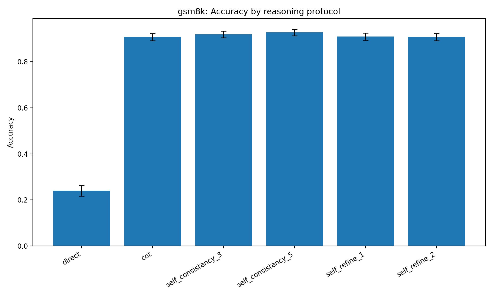
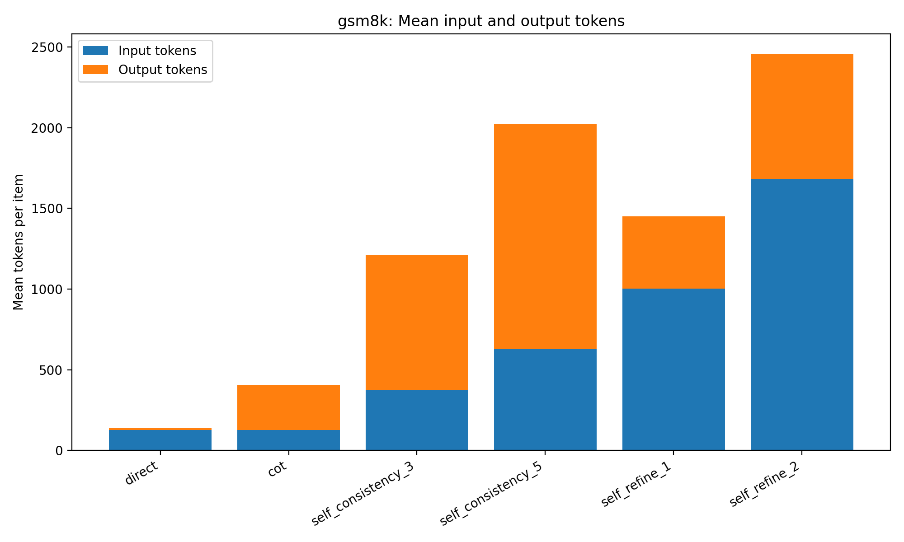
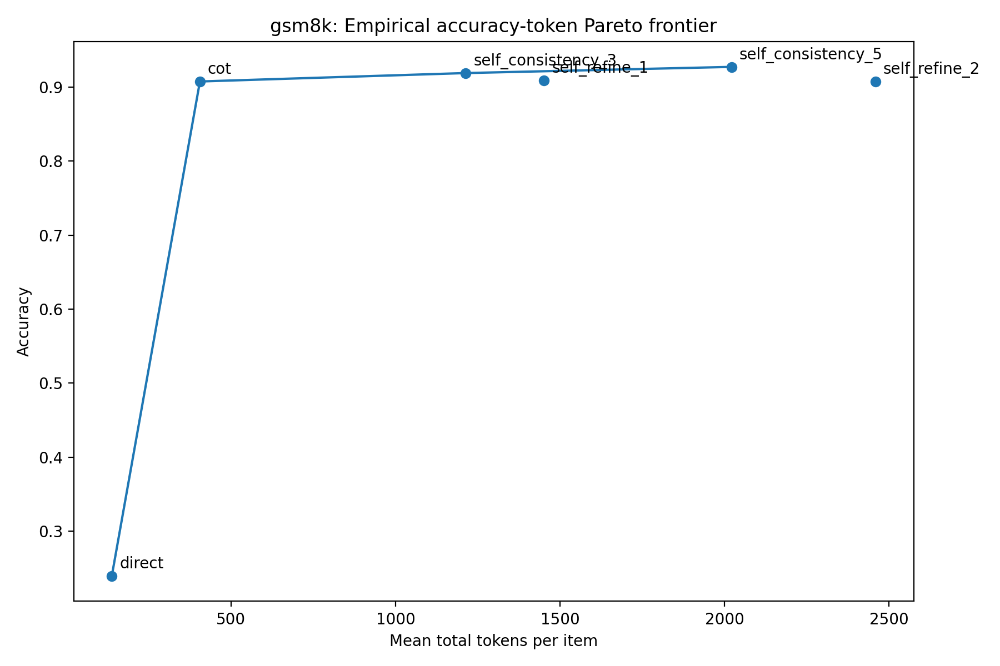
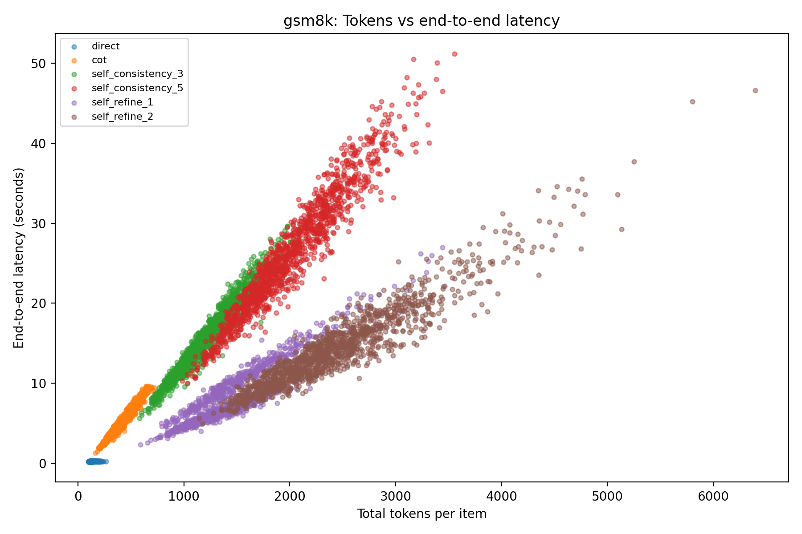

# Qwen2.5-7B-Instruct 在 GSM8K 上的推理时 Token Economy 实验报告

Direct、Chain-of-Thought、Self-Consistency 与 Self-Refine 的准确率—资源权衡

报告范围：GSM8K 主实验（1,319 题，单随机种子 20260730）

数据截止：2026 年 8 月 2 日

<!-- PAGEBREAK -->

## 摘要

本实验在固定模型、数据集与硬件条件下，比较 Direct、Chain-of-Thought（CoT）、Self-Consistency@3（SC@3）、Self-Consistency@5（SC@5）、Self-Refine@1（SR@1）和 Self-Refine@2（SR@2）六种推理时协议的准确率与资源开销。实验采用 Qwen2.5-7B-Instruct、BF16 精度和单张 NVIDIA A100 80GB，在 GSM8K 本地 test 快照的全部 1,319 个样本上运行。结果表明，CoT 是主要性能跃迁点：准确率由 Direct 的 23.96% 提升到 90.75%，平均总 token 从 137.6 增至 405.4；虽然单题 token 成本约为 Direct 的 2.95 倍，但每个正确答案对应的 token 数由 574.5 降至 446.7，为六种协议中最低。SC@5 获得最高点估计准确率 92.72%，但相较 CoT 仅增加 1.97 个百分点，同时平均 token 和时延分别增至 CoT 的 4.99 倍和 5.15 倍。SR@1 与 SR@2 未表现出相称的准确率收益，并在准确率—token 二维比较中处于劣势。所有高级推理协议相对 Direct 的配对提升均有极强统计证据；但当前结果包没有保留高级协议之间的逐题配对检验或多随机种子结果，因此 SC@5 相对 CoT、SC@3 的优势应解释为描述性点估计，而非已证实的显著提升。综合来看，CoT 是本实验条件下最适合作为默认策略的协议；当准确率优先且可以接受显著更高的推理成本时，可考虑 SC@3 或 SC@5。

关键词：Qwen2.5-7B-Instruct；GSM8K；Chain-of-Thought；Self-Consistency；Self-Refine；Token Economy；推理时计算

> [结论先行] CoT 以约 3 倍 Direct 的 token 成本实现了主要准确率跃迁，并取得最低的 tokens-per-correct；SC@5 的准确率点估计最高，但后续计算投入呈明显边际递减；当前 Self-Refine 实现不具 token 经济性。

## 1. 实验背景与研究问题

### 1.1 背景

大语言模型可以在不改变模型权重的情况下，通过增加推理步骤、重复采样或自我反馈来提高任务表现。此类方法通常以更多模型调用、token 和等待时间换取更高准确率，因此仅比较准确率不足以支持实际部署决策。本实验以“推理时 token 经济性”为核心，在同一模型与同一题集上比较多种推理协议，关注性能提升是否与新增资源消耗相匹配。

本报告所称“经济性”是实验性的工程概念，具体由准确率、输入/输出/总 token、模型调用次数、生成时延、协议级 call-summed end-to-end 时延和 PyTorch 峰值已分配显存衡量；实验没有测量货币费用、能耗或并发吞吐。

### 1.2 研究问题

1. 相较于仅输出最终答案的 Direct 协议，CoT、Self-Consistency 和 Self-Refine 能否提高 GSM8K 准确率？
2. 从 CoT 继续增加采样数或反思轮数后，准确率收益是否仍能覆盖额外 token 与时延成本？
3. 哪些协议位于经验准确率—token Pareto 前沿，哪些协议被其他方案支配？
4. 高级推理协议相对 Direct 的逐题准确率差异是否具有统计证据？
5. 不同部署偏好（综合性价比、最高准确率、最低时延）分别适合何种协议？

### 1.3 报告范围与证据边界

本报告仅分析仓库中可核验的 GSM8K 主实验聚合结果：六种协议、每种 1,319 题、随机种子 20260730。仓库虽然包含 MATH-500 和额外随机种子的配置及分析脚本，但结果目录没有相应汇总表、图或状态文件，因此这些内容仅列为扩展计划，不纳入实证结论。

数值结论直接取自 `results/summary/gsm8k_main_qwen25_7b__summary.csv`，并对准确率、token 算术、成本倍率和相邻协议增量进行了复核。当前 checkout 没有逐样本原始 JSONL、per-item 表或独立 paired 表；因此本报告可以核对汇总口径，但无法从本地原始记录独立重算 bootstrap、McNemar 检验、错误案例和高级协议之间的配对差异。

## 2. 实验设计与方法

### 2.1 模型、数据与运行环境

|项目|设置|证据来源|
|---|---|---|
|模型|Qwen2.5-7B-Instruct，本地离线加载|`README.md`；`configs/gsm8k_main.yaml`|
|数值精度|BF16，无量化|`environment/model_decision.txt`|
|硬件|1 × NVIDIA A100 80GB|`README.md`；`environment/model_decision.txt`|
|数据集|GSM8K 本地 test 快照，1,319 题|`data/dataset_metadata.json`|
|实验样本|全部 1,319 题；每协议题目集合一致|`configs/gsm8k_main.yaml`；分析器校验逻辑|
|随机种子|sample seed = 20260730；run seed = 20260730|`configs/gsm8k_main.yaml`|
|生成上限|普通生成和 critique 均为 512 new tokens/call|`configs/gsm8k_main.yaml`|
|主要软件|PyTorch 2.12.0+cu130；Transformers 4.57.6；NumPy 2.2.6；pandas 2.3.3；SciPy 1.15.3|`environment/pip_freeze.txt`|

数据元数据把上游 `source_split` 记为 `validation`，而下载脚本请求的是 `test`；两处记录不一致。鉴于快照包含 1,319 行且本地实验固定读取 `test`，本报告统一称其为“本地 test 快照”，不进一步断言上游分支名称。

### 2.2 推理协议

|协议|核心操作|解码设置|模型调用数/题|
|---|---|---|---:|
|Direct|要求仅输出最终答案，不展示解释|temperature 0；top_p 1.0|1|
|CoT|要求给出简洁的逐步推导，再输出最终答案|temperature 0；top_p 1.0|1|
|SC@3|生成 3 个 CoT 候选，按抽取后的数值多数投票|temperature 0.7；top_p 0.95|3|
|SC@5|生成 5 个 CoT 候选，按抽取后的数值多数投票|temperature 0.7；top_p 0.95|5|
|SR@1|1 次初始 CoT + 1 次 critique + 1 次 revision|全部 temperature 0；top_p 1.0|3|
|SR@2|1 次初始 CoT + 两轮 critique/revision|全部 temperature 0；top_p 1.0|5|

六种协议共用同一 system prompt。Direct 与 CoT 不仅计算量不同，用户提示也不同；SC 还改变了解码随机性。因此本实验估计的是“完整提示词—解码—调用协议”的总体效果，不能把差异简单归因于单一的“是否推理”。

Self-Consistency 对 GSM8K 候选答案先进行数值规范化，再投票选择出现次数最多的答案；若平票，则选择最早出现的有效候选；若全部无效，则退回第一个候选。Self-Refine 的 critique 阶段被要求只检查问题而不产生新答案，revision 阶段根据原题、候选与 critique 重新生成最终解。

### 2.3 实验流程

1. 从 ModelScope 下载并冻结数据快照，记录行数、字段、fingerprint 与文件 SHA-256。
2. 读取 YAML 配置，校验模型精度、数据集、样本数、生成上限和协议名称。
3. 本地加载 Qwen2.5-7B-Instruct；每个协议进程开始时执行一次不计分、不计 token 和时延的 warm-up。
4. 对固定题目清单逐题运行目标协议；每次调用记录输入、输出、总 token、生成时延、call-level end-to-end 时延、峰值已分配显存和是否触及生成上限。
5. 对输出优先抽取最后一个 `FINAL_ANSWER:`，其次抽取最后一个 `\boxed{}`；GSM8K 还允许退回到全文最后一个数值。预测与 gold 经数值规范化后用 Decimal 精确相等计分。
6. 分析器检查各协议样本数、sample ID 集合和 token 算术，随后计算汇总指标、置信区间、配对检验与图表。

### 2.4 指标与统计方法

准确率定义为 `Accuracy = correct_count / N`。平均总 token 是一次协议中所有模型调用的 input token 与 output token 之和，再对题目求平均。相对 token 成本定义为 `MeanTotalTokens(protocol) / MeanTotalTokens(Direct)`。

`tokens_per_correct = 所有题的总 token / 正确题数`。该指标不是“只在答对题目上计算的平均 token”，而是把完成整个测试集的总 token 分摊到成功答案上，可用于衡量产出一个正确答案所对应的总体 token 消耗。

报告使用以下统计口径：准确率为 10,000 次 percentile bootstrap 的 95% 置信区间；每个高级协议相对 Direct 的准确率差值使用逐题 paired bootstrap 95% 置信区间；配对二元正确性差异使用双侧 exact McNemar 检验。Pareto 前沿基于协议级平均总 token 与准确率点估计：若另一协议 token 不更多、准确率不更低且至少一项严格更优，则当前协议被支配。

### 2.5 运行状态

状态文件显示 `gsm8k_main_remaining` bundle 成功完成 CoT、SC@3、SC@5、SR@1 和 SR@2，UTC 起止时间为 2026-07-31 16:46:45 至 2026-08-01 18:31:29，历时约 25 小时 44 分钟。按五种协议的 `n × 平均协议级时延` 复算约为 25.69 小时，与状态墙钟仅相差约 3.5 分钟，时间记录总体自洽。Direct 已进入汇总表，但当前结果包没有保留其独立状态文件。

## 3. 实验结果

### 3.1 总体准确率与成本

|协议|正确数|准确率（95% CI）|平均总 token|相对 Direct|平均时延/s|调用数|Pareto|
|---|---:|---:|---:|---:|---:|---:|---:|
|Direct|316|23.96%（21.68%–26.23%）|137.6|1.00×|0.21|1|是|
|CoT|1,197|90.75%（89.16%–92.27%）|405.4|2.95×|5.15|1|是|
|SC@3|1,212|91.89%（90.37%–93.33%）|1,213.1|8.81×|15.77|3|是|
|SC@5|1,223|92.72%（91.28%–94.09%）|2,020.9|14.68×|26.48|5|是|
|SR@1|1,199|90.90%（89.31%–92.42%）|1,451.2|10.54×|8.17|3|否|
|SR@2|1,197|90.75%（89.16%–92.27%）|2,459.2|17.87×|14.55|5|否|

来源：`results/summary/gsm8k_main_qwen25_7b__summary.csv` 与对应结果图。

CoT 将准确率从 23.96% 提升到 90.75%，绝对提高 66.79 个百分点，是全部增益中的主体。相较之下，SC@3 和 SC@5 分别在 CoT 基础上仅提高 1.14 和 1.97 个百分点。SR@1 仅比 CoT 多答对 2 题，SR@2 与 CoT 的正确数完全相同。

所有高级协议相对 Direct 的逐题提升都具有极强统计证据：配对差值的 95% CI 全部远离 0，exact McNemar 检验均 `p < 0.001`。其中 CoT 相对 Direct 的配对差值为 66.79 个百分点（95% CI：64.14–69.45），Direct 正确而 CoT 错误为 13 题，Direct 错误而 CoT 正确为 894 题。SC@5 相对 Direct 的配对差值为 68.76 个百分点（95% CI：66.11–71.34），对应不一致题数为 10 与 917。

|协议（对 Direct）|配对差值，百分点（95% CI）|Direct 独对 / 该协议独对|exact McNemar p|
|---|---:|---:|---:|
|CoT|66.79（64.14–69.45）|13 / 894|7.77E-245|
|SC@3|67.93（65.28–70.43）|10 / 906|3.98E-253|
|SC@5|68.76（66.11–71.34）|10 / 917|2.19E-256|
|SR@1|66.94（64.22–69.60）|13 / 896|2.00E-245|
|SR@2|66.79（64.06–69.45）|16 / 897|2.87E-241|

现有配对统计只比较各协议与 Direct，并未比较 CoT、SC@3、SC@5 和 Self-Refine 彼此之间。它们的准确率置信区间也有明显重叠，因此不能依据当前结果宣称 SC@5 显著优于 CoT 或 SC@3。

### 3.2 Token 成本与正确答案效率

Self-Consistency 的成本主要来自重复生成输出；Self-Refine 则因每轮 revision 都携带原题、上一版候选和 critique，输入 token 占比显著上升。SC@3 与 SR@1 同为 3 次调用，但平均总 token 分别为 1,213.1 和 1,451.2；SC@5 与 SR@2 同为 5 次调用，分别为 2,020.9 和 2,459.2。

|协议|平均 token/题|tokens-per-correct|相对 CoT 的准确率增量|相对 CoT 的额外 token|
|---|---:|---:|---:|---:|
|Direct|137.6|574.5|-66.79 个百分点|-267.8|
|CoT|405.4|446.7|基准|基准|
|SC@3|1,213.1|1,320.2|+1.14 个百分点|+807.7|
|SC@5|2,020.9|2,179.6|+1.97 个百分点|+1,615.5|
|SR@1|1,451.2|1,596.5|+0.15 个百分点|+1,045.8|
|SR@2|2,459.2|2,709.9|0.00 个百分点|+2,053.8|

CoT 的平均 token 虽然约为 Direct 的 2.95 倍，但因为准确率大幅提高，其 tokens-per-correct 反而最低：446.7，较 Direct 的 574.5 下降约 22.2%。这说明“每题 token 更多”与“每个成功答案成本更高”并不等价。

沿 Pareto 前沿观察相邻增量，CoT→SC@3 需要额外约 807.7 token 才增加 1.14 个百分点，即每额外 1,000 token 约增加 1.41 个百分点；SC@3→SC@5 再增加约 807.9 token，只增加 0.83 个百分点，即每额外 1,000 token 约增加 1.03 个百分点。仓库的 marginal-efficiency 图以 Direct 为共同分母，适合比较“相对 Direct 的总体效率”，但不代表相邻协议的真实边际收益；因此本报告同时给出上述相邻增量。

### 3.3 准确率—Token Pareto 前沿

Direct、CoT、SC@3 和 SC@5 位于基于点估计的经验 Pareto 前沿。Direct 提供最低资源消耗；CoT 以中等 token 成本实现主要准确率跃迁；SC@3 和 SC@5 继续用更高成本换取小幅点估计提升。

SR@1 在准确率与 token 两个维度上被 SC@3 严格支配：SC@3 准确率更高，平均 token 还少约 238.1。SR@2 与 CoT 准确率相同，却多消耗约 2,053.8 token/题，因此被 CoT 严格支配。需要注意，Pareto 判定只使用准确率与 token 两个维度；若把时延加入三维目标，SR@1 比 SC@3 更快，部署选择仍需结合延迟约束。

### 3.4 时延、吞吐特征与显存

|协议|平均 E2E/s|P95 E2E/s|相对 Direct 时延|平均输出 token/s|平均峰值已分配显存/MB|
|---|---:|---:|---:|---:|---:|
|Direct|0.211|0.249|1.0×|53.9|14,557.9|
|CoT|5.145|8.035|24.4×|54.5|14,559.5|
|SC@3|15.765|23.697|74.8×|53.1|14,565.2|
|SC@5|26.480|39.814|125.6×|52.7|14,566.0|
|SR@1|8.167|14.986|38.7×|54.9|14,622.0|
|SR@2|14.551|23.771|69.0×|53.3|14,624.9|

各协议的平均输出生成速度约为 52.7–54.9 token/s，说明时延主要由生成的输出 token 决定。Self-Refine 的总 token 高，但大量成本位于输入上下文，因此相同调用次数下比 Self-Consistency 更快。额外推理几乎没有显著增加峰值已分配显存：六种协议平均值仅相差约 67 MB；主要资源代价是 token 与串行等待时间，而非峰值显存。

这里的“end-to-end”是每次模型调用从 tokenization 前到 decode 后的计时，再对一题中的多次调用求和；它不包含模型加载、warm-up、题间 I/O、投票、解析和服务排队，也不等同于并发部署吞吐。SC 候选在当前代码中串行生成，若改为 batch 或并行，实际时延排序和资源曲线可能变化。

### 3.5 输出质量与尾部风险

|协议|P95 总 token|解析错误率|题级截断率|数值回退率|
|---|---:|---:|---:|---:|
|Direct|181.0|0.08%|0.00%|0.00%|
|CoT|586.1|0.53%|1.36%|1.36%|
|SC@3|1,691.0|0.15%|3.64%|1.14%|
|SC@5|2,814.1|0.08%|5.53%|0.91%|
|SR@1|2,112.1|0.99%|1.97%|0.76%|
|SR@2|3,660.5|0.99%|2.58%|0.30%|

SC@5 的题级截断率最高，为 5.53%；Self-Refine 的解析错误率最高，SR@1 与 SR@2 均约为 0.99%。题级截断定义为“一题中的任一调用达到 max_new_tokens”，多调用协议天然有更多触发机会，因此不能把该比例直接理解为单次调用的截断概率。token 均值均高于中位数，且 P95 明显高于均值，说明成本分布右偏；在线系统若只按均值规划预算，可能低估尾部延迟。

## 4. 讨论

### 4.1 主要发现

第一，是否允许模型显式展开推导，是本实验中最重要的性能分界。CoT 仅用一次调用，却把正确数从 316 提升到 1,197，贡献了绝大部分可观察增益。

第二，重复采样能够继续抬高准确率点估计，但收益远小于初次引入 CoT。SC@3 比 CoT 多答对 15 题，SC@5 比 SC@3 再多答对 11 题；两个阶段都新增约 808 token/题，边际效率从 1.41 降至 1.03 个百分点/额外 1,000 token。

第三，当前 Self-Refine 提示与确定性解码设置没有形成有效的准确率—token 交换。可能原因包括：初始 CoT 已达到约 91% 准确率，剩余错误难以仅靠同一模型的自我批评修正；确定性 critique/revision 缺少候选多样性；长上下文增加了输入成本但未带来新的有效证据。这些解释属于基于结果与实现的推断，仍需逐题错误分析和消融实验验证。

第四，优化目标会改变“最佳协议”的定义。按每题平均 token，Direct 最便宜；按准确率点估计，SC@5 最高；按 tokens-per-correct 与总体成本—准确率平衡，CoT 最优；按二维 Pareto，Direct、CoT、SC@3、SC@5 都有合理部署区间。

### 4.2 部署建议

|部署目标|推荐协议|理由|主要注意事项|
|---|---|---|---|
|默认生产策略|CoT|90.75% 准确率；最低 tokens-per-correct；单次调用|平均时延约 5.15 s，仍显著高于 Direct|
|准确率优先、预算中等|SC@3|点估计 91.89%；比 SC@5 少约 808 token 和 10.7 s|相对 CoT 的显著性尚未做配对验证|
|准确率极优先|SC@5|最高点估计 92.72%|14.68× Direct token；平均 26.48 s；截断率最高|
|极低延迟或极低 token|Direct|0.21 s；137.6 token/题|准确率仅 23.96%，不适合高可靠数学问答|
|当前不建议|SR@1、SR@2|未体现相称准确率收益|应先重构提示、停止规则或引入多样化再复测|

如果任务允许动态路由，更值得验证的方向是“先运行 CoT，仅对低置信度或验证失败的题目追加 SC”，而不是对全部题目统一采用 SC@5。当前结果没有置信度字段或逐题路由实验，这一建议属于后续工程假设。

## 5. 有效性威胁与局限性

### 5.1 内部有效性

Direct、CoT、SC 和 Self-Refine 同时改变了提示形式、解码随机性、调用次数和上下文长度，协议间差异是组合处理效果，无法分离“推理文字”“采样”“投票”或“额外计算”各自的独立贡献。完整六协议实验只有一个 run seed；代码虽设置 Python、PyTorch 与 CUDA seed，但未启用严格确定性算法，因此跨环境不保证逐 token 一致。

smoke、pilot 与 main 配置都使用 test split。若曾根据同一测试集上的前序结果调整提示词或 token 上限，可能存在测试集开发复用造成的选择偏倚；仓库没有预注册或配置冻结时间线，无法排除此风险。

### 5.2 统计结论边界

bootstrap 区间反映题目抽样不确定性，不反映随机解码的 seed-to-seed 波动。配对 bootstrap 和 exact McNemar 只针对各协议与 Direct；高级协议之间没有逐题配对统计，也没有多重比较校正。Pareto 前沿基于点估计，没有 token、时延或 Pareto 归属的不确定性区间。

### 5.3 测量边界

实验的时延来自单样本、串行调用和单卡环境，不含模型加载、服务排队、网络和大部分协议编排开销，不能直接外推到批处理或并发服务。峰值显存是 PyTorch `max_memory_allocated`，不是整卡实际占用。实验没有记录能耗、功率、货币费用与吞吐，因此“经济性”结论仅限已测指标。

### 5.4 复现性

当前仓库包含配置、代码、汇总表、图、数据 fingerprint/SHA-256 和部分模型元数据，具备中等程度的过程追溯性；但原始逐题 JSONL 和数据快照未随 checkout 提供，模型元数据也没有记录所有 safetensors 分片哈希或上游 revision。数据下载环境记录 `datasets 3.6.0`，推理环境 freeze 则记录 `datasets 4.8.5`，说明二者可能是不同环境。Python、操作系统、NVIDIA 驱动、CPU/RAM 和 A100 形态也未记录。

汇总 CSV 自身不嵌入配置哈希、Git commit、数据 fingerprint 或模型 revision，归档后依赖外部文件关联。状态文件仅覆盖 “remaining” 的五个高级协议，Direct 的独立运行状态与日志缺失。

### 5.5 外部有效性

实证范围仅覆盖一个 7B 模型、一个小学数学文字题数据集、一个硬件平台和一个主随机种子。结果不能直接推广到更大模型、MATH-500、代码生成、中文任务、开放式问答、不同 GPU 或量化模型。仓库已有 MATH-500 与多随机种子配置，但在结果产物补齐之前，它们仍属于计划实验。

## 6. 可复现步骤与归档建议

在具备本地模型 `models/Qwen2.5-7B-Instruct`、本地数据快照和相容 CUDA/BF16 环境的前提下，核心命令为：

`python src/run_experiment.py --config configs/gsm8k_main.yaml --protocol <protocol>`

依次对六个协议运行后，使用：

`python src/analyze_results.py --root . --config configs/gsm8k_main.yaml --n-boot 10000`

为把可复现性从“部分可复现”提升到“可独立复算”，建议补充：六个 GSM8K 原始 JSONL 的固定 Release 链接与 SHA-256；Direct 状态与运行日志；模型 revision 和全部权重分片哈希；Python、OS、驱动、GPU 型号/形态、CPU/RAM；可移植环境锁文件；配置 SHA-256、Git commit、数据 fingerprint 和模型 revision 写入 summary/status；以及不依赖原服务器绝对路径的端到端测试。

## 7. 结论

在 Qwen2.5-7B-Instruct、BF16、单张 A100 80GB 与 GSM8K 1,319 题的固定条件下，CoT 是最关键且最具经济性的推理协议变化：它用约 2.95 倍 Direct 的平均 token 将准确率从 23.96% 提升至 90.75%，并取得六种协议中最低的 tokens-per-correct。Self-Consistency 继续将准确率点估计提高到 91.89%（SC@3）和 92.72%（SC@5），但额外收益快速递减；SC@5 相对 CoT 仅多答对 26 题，却需要约 4.99 倍 token 和 5.15 倍时延。Self-Refine 在当前实现下没有形成有效的准确率—token 交换，SR@2 甚至与 CoT 正确数相同而成本显著更高。

因此，本实验支持把 CoT 作为默认策略，把 SC@3/SC@5 保留给准确率优先且预算充足的场景，并暂缓采用当前 Self-Refine 配置。由于高级协议之间缺少配对显著性检验且没有多随机种子结果，SC@5 的最高准确率应被视为有待重复实验确认的描述性优势。

## 附录 A：证据来源索引

|证据|本报告用途|
|---|---|
|`README.md`|实验概要、模型、硬件、数据集和指标列表|
|`configs/gsm8k_main.yaml`|主实验模型、样本、种子、token 上限和协议|
|`src/run_experiment.py`|提示词、解码、投票、自我修正、计分与记录口径|
|`src/analyze_results.py`|bootstrap、McNemar、汇总指标与 Pareto 定义|
|`results/summary/gsm8k_main_qwen25_7b__summary.csv`|全部定量结果|
|`results/figures/*.png`|准确率、token、Pareto、分布与时延可视化|
|`results/status/gsm8k_main_remaining.json`|五个高级协议 bundle 的运行状态与时间|
|`data/dataset_metadata.json`|数据来源、规模、fingerprint 和文件哈希|
|`environment/model_decision.txt`|模型、BF16、单 GPU 与无量化决策|
|`environment/pip_freeze.txt`|软件依赖版本|

## 附录 B：后续实验优先级

1. 补齐 GSM8K 的三个 run seed，至少对 CoT、SC@3、SC@5 报告 seed 均值、标准差和逐题配对差异。
2. 对 CoT、SC@3、SC@5 做两两 paired bootstrap 与 exact McNemar，并说明多重比较处理。
3. 恢复逐题原始结果，按题目难度、答案长度、截断、解析错误和投票分歧做错误分析。
4. 增加自适应路由：CoT 先行，仅对低置信度或验证失败样本追加采样。
5. 对 Self-Refine 做消融，包括确定性与随机 critique、早停规则、外部验证器和只对疑难题触发。
6. 统一并完成 MATH-500 的最终配置版本，再验证跨数据集泛化。
7. 在 batch、并发服务和不同硬件上重新测量吞吐、尾部时延、功耗与实际费用。
